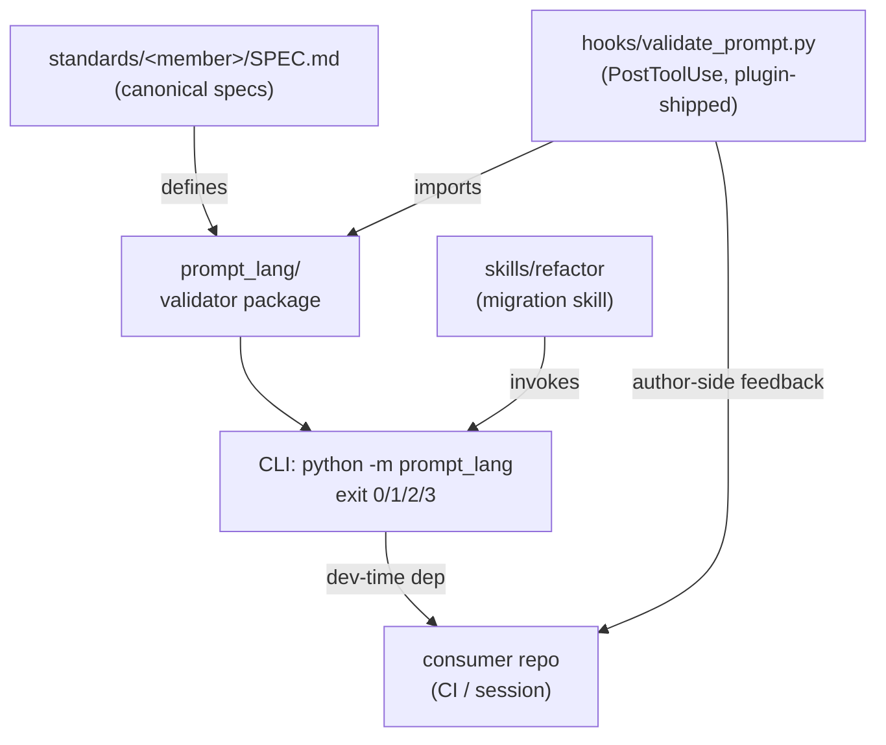

# Map - foundations

> **Contract** - one question: *what are the pieces, and how do they connect?*
> <=2 pages - update on add / remove / rewire of a Component - hand-edited.

## Diagram

<!-- The ONE diagram in this project, at ~C4 container zoom. Anything deeper
     rots faster than you can maintain it - use the table below for detail. -->

## Components
<!-- One row per piece - one-line responsibility - link the deep doc once it exists (else "no doc yet"). -->

| Component | Responsibility (one line) | Status | Deep doc |
|---|---|---|---|
| `standards/promptlang/SPEC.md` | canonical PromptLang spec — the form standard for prompt files | stable (v1.0) | standards/promptlang/SPEC.md |
| `standards/theory/SPEC.md` | canonical Theory spec — commit nothing you could not explain (spec-only member) | stable (v1.0) | standards/theory/SPEC.md |
| `prompt_lang/` | the PromptLang validator package (parser · validator · config · directives · CLI); ships the default config | stable | no doc yet |
| `skills/refactor/` | migration + validation skill invoking the CLI (plugin-distributable) | stable | no doc yet |
| `hooks/` | author-side PostToolUse hook — validates prompt-artifact writes; silent no-op without `prompt_lang` | stable | no doc yet |
| `.claude-plugin/` | plugin + marketplace manifests (version mirrors `pyproject.toml`) | stable | no doc yet |
| `.github/workflows/` | self-CI — the suite on ubuntu+windows × py 3.11/3.12 at every push/PR to main | stable | no doc yet |
| `scripts/` | repo governance playbook — the versioned `protect-main` ruleset + its exact apply call | stable | no doc yet |
| `tests/` | ported validator/parser/config/directives suites + self-validation + hook three-branch contract | stable (69 green) | no doc yet |
| `decisions/` | append-only ADR trail (why-history) | live | no doc yet |
